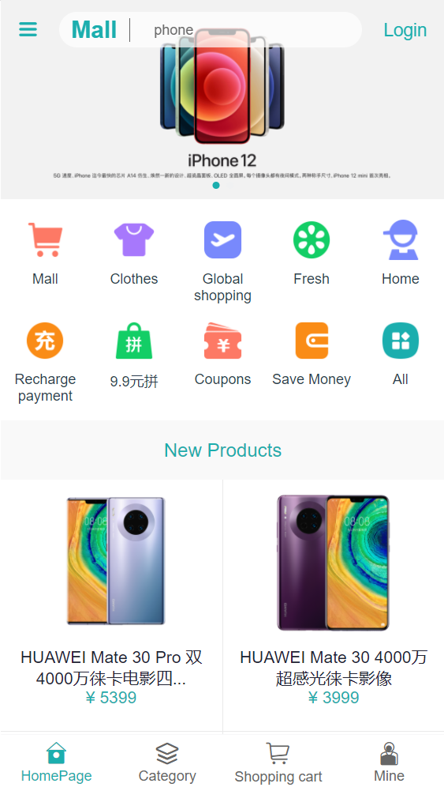
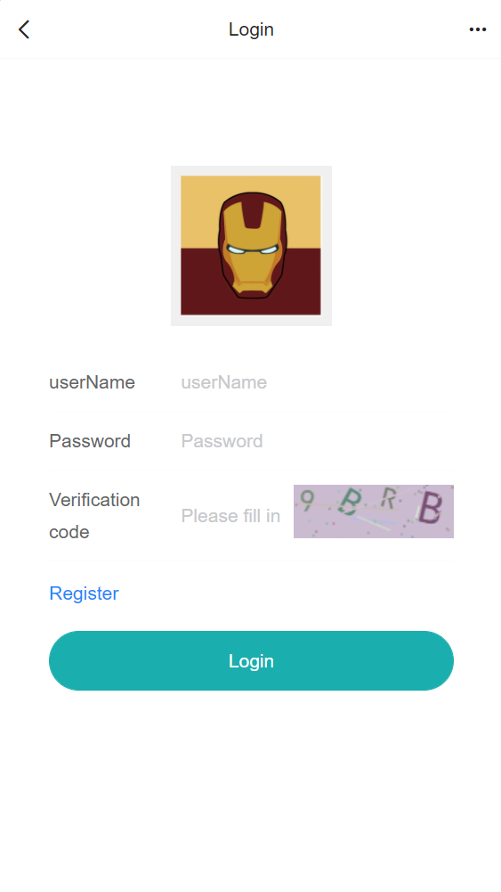
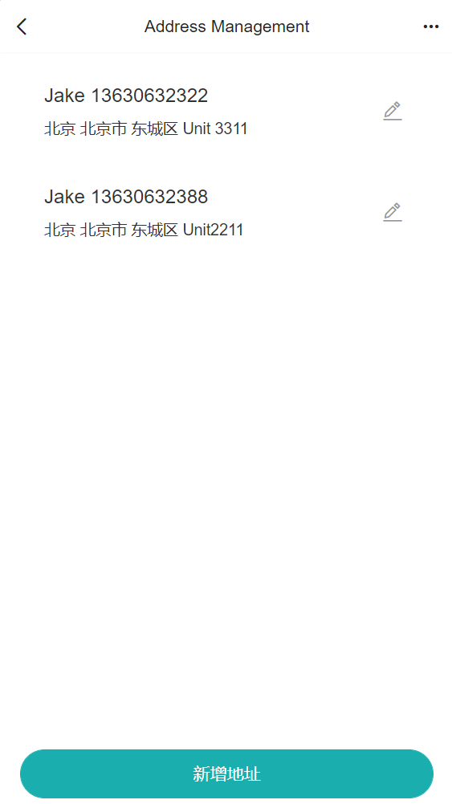
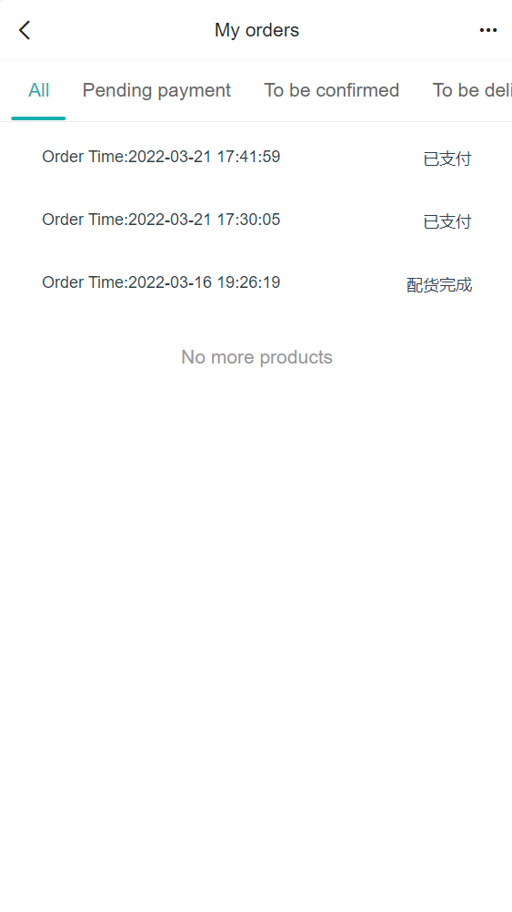
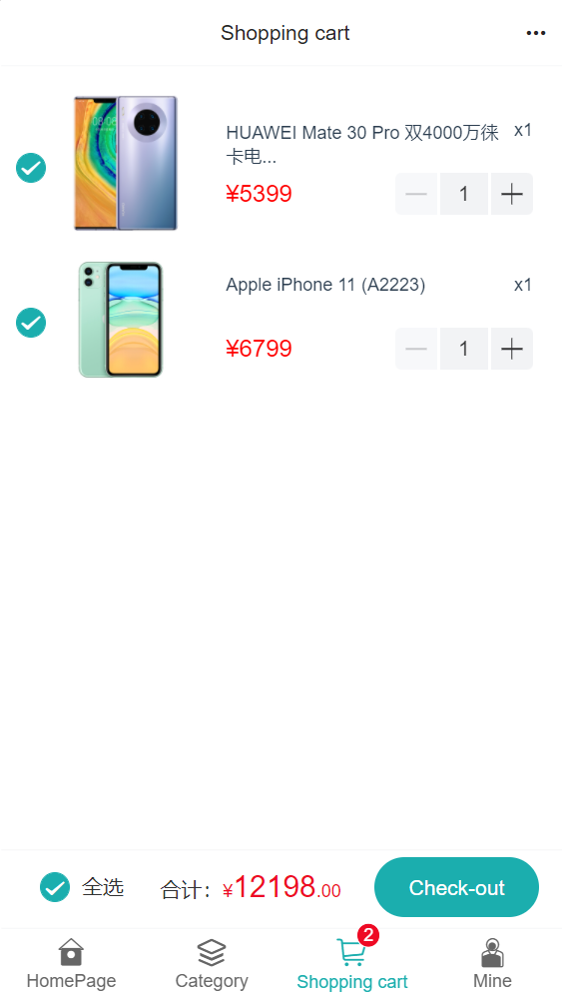
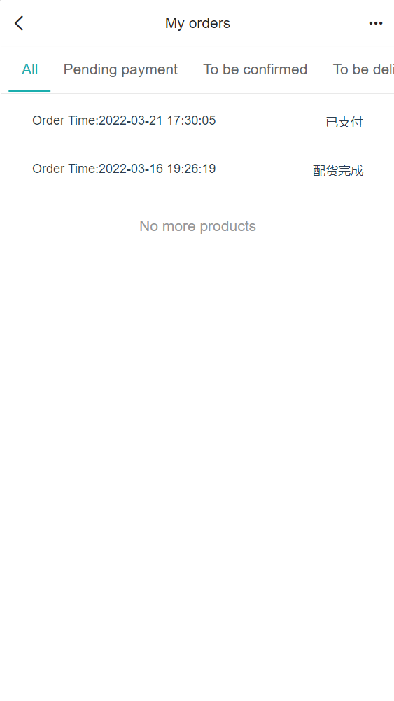
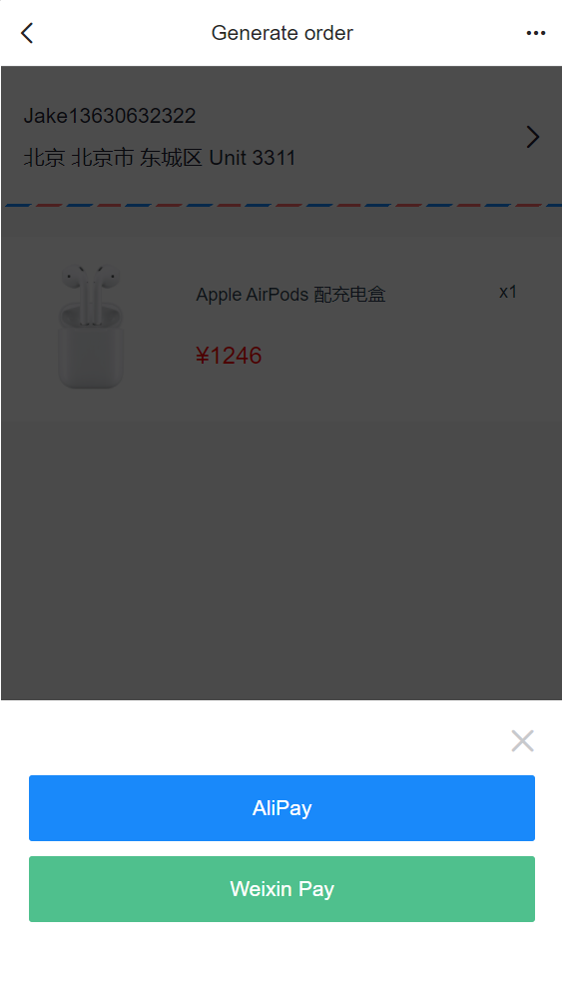
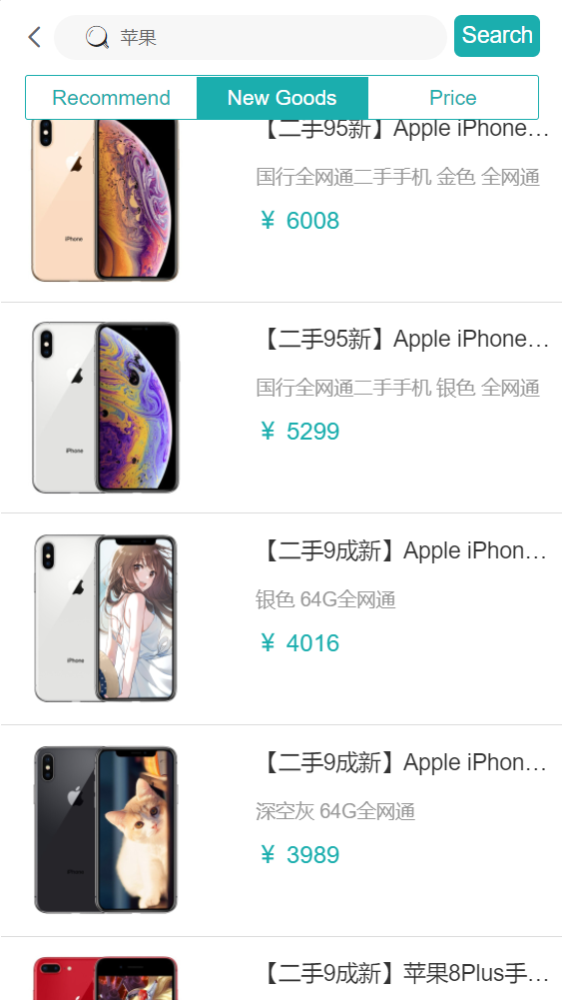
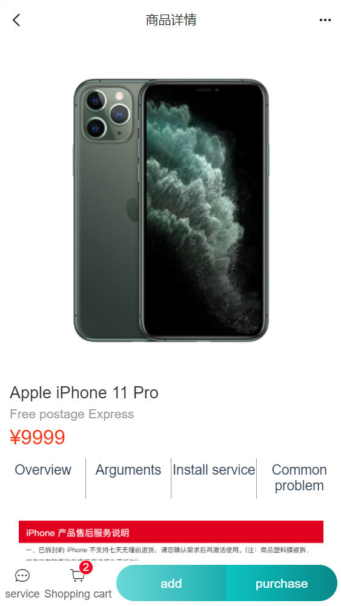

# Mall project


## Introduction

This project is an e-commerce system, including mall systems and background management systems, based on Spring Boot 2.x and Vue3 and related technology stack development.
The front desk commercial city system includes the home page portal, product classification, new line, home round broadcast, product recommendation, product search, merchandise display, shopping cart, order settlement, order process, personal order management, member center, help center, etc. module.
The background management system contains data panels, round-screen management, product management, order management, membership management, classification management, and setting modules.


Stacks:

1.Front End

```txt
Axios 
Better-scroll
Vant
Vue-router
Eslint
```


2.Backend

```txt
Mybatis
Lombok
Mysql
SpringSecurity
```


## Pages Demonstration

The following is a page preview:

**1.HomePage:**




2.LoginPage



3.Address Management



4.Order History



5.Shopping Cart




6.Orders List



7.Payment




8.Product Search



9.Product Info


